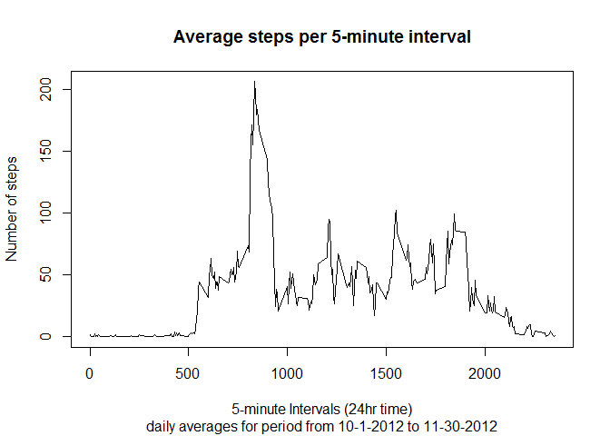
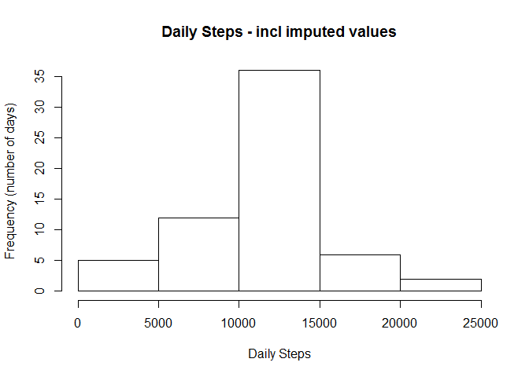
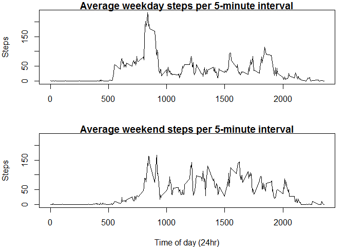

# Reproducible Research: Peer Assessment 1


## Overview
The purpose of this document is to answer several questions about the activity (steps) taken by one individual over a 60 day period in 2012.

All code and results are shown in this document.

## Setup
Begin by setting up our environment with the necessary packages and default settings. Make note of any version incompatibilities. 


```r
library(knitr)
```

```
## Warning: package 'knitr' was built under R version 3.3.3
```

```r
opts_chunk$set(echo = TRUE)
library(data.table)
library(chron)
```

```
## Warning: package 'chron' was built under R version 3.3.3
```

##1. Data Prepration
The dataset used for this research (activity.csv) should be stored in your working directory.  If not presently on your local system you can [download it here](https://d396qusza40orc.cloudfront.net/repdata%2Fdata%2Factivity.zip).

The data contains data for steps taken by one individual over a 60 day period.  The data is a matrix Of 3 columns and 17,568 observations (rows). The columns are "steps","date", and "interval". The rows record the number of steps taken in 5-minute intervals throughout the day (288 observations per day).

Read the unzipped file into memory and convert the date strings to dates.

```r
data <- as.data.table(read.csv("activity.csv",header=TRUE))
data$date <- as.Date(data$date)
```
Once loaded, we can now proceed with the analysis.


##2. What is the mean total number of steps taken per day?
To answer the question, we first calculate the total number of steps taken each day and plot the result in a histogram.  We also calculate the mean and median steps taken per day.


```r
options(scipen=999,digits=6)
dailyttls <- data[,.(steps=sum(steps)),by='date']
hist(dailyttls$steps,
     main="Daily Steps",
     xlab="Daily Steps",
     ylab="Frequency (number of days)")
```

<!-- -->

```r
#dailymean <- data[,.(steps=mean(steps,na.rm =TRUE)),by='date']
ttlmean <- round(mean(dailyttls$steps,na.rm=TRUE),0)
ttlmedian <- median(dailyttls$steps,na.rm=TRUE)
```
The mean number of steps taken each day during this period is 10766 while the median number of steps is 10765.

##3. What is the average daily activity pattern?
Next we look at the pattern of activity at intervals throughout the day by plotting the average steps taken during each 5-minute interval across all days.

```r
intervals <- data[,list(steps=mean(steps,na.rm=TRUE)),by='interval']
plot(intervals$interval,
     intervals$steps,type="l",
     xlab="5-minute Intervals (24hr time)",
     ylab="Number of steps",
     main="Average steps per 5-minute interval",
     sub="daily averages for period from 10-1-2012 to 11-30-2012")
```

<!-- -->

We then determine the 5-minute interval that, on average across all days in the dataset, contains the maximum number of steps as follows:

```r
maxsteptime <- intervals[which.max(intervals$steps),interval]
```
The interval with the maximum number of steps (on average) is 835 (24 hour clock time).

##4. Data quality and missing values
Step 1: calculate and report the total number of missing values in the dataset.

```r
navalues <- sum(is.na(data$steps))
pctna <- round(navalues/nrow(data)*100,1)
```
The number of missing values in the dataset is 2304 or about 13.1% of the observations.

Step 2: Devise a strategy for filling in missing values.
Our strategy will be to use the non-NA mean of each interval across the 60 day period to impute missing value for the given interval. For example, the mean of all non-NA observations for 905 will be used to replace any missing values for 905 observations.

Step 3: Create a new data set with missing values replaced by mean for interval time
Implementing our strategy, we now replace the NA values in the dataset.

```r
setDT(data)
#function for calculating the mean of each interval
impute.mean <- function(x) 
        replace(x, is.na(x), as.integer(mean(x, na.rm = TRUE)))

imputeddata <- data[,steps := impute.mean(steps),by=interval]

impdailyttls <- imputeddata[,.(steps=sum(steps)),by='date']
```

Step 4: Finalize
First we make a histogram to examine the distribution of steps taken each day.

```r
hist(impdailyttls$steps,
     main="Daily Steps - incl imputed values",
     xlab="Daily Steps",
     ylab="Frequency (number of days)")
```

<!-- -->

While the shape of the histogram is similar to the original data set, there are far more days with ~10000 steps.

Next we calculate new mean and median values for the dataset with imputed values.

```r
intervals2 <- imputeddata[,list(steps=mean(steps)),by='interval']
ttlimpmean <- round(mean(impdailyttls$steps,na.rm=TRUE),0)
ttlimpmedian <- median(impdailyttls$steps,na.rm=TRUE)
```
The mean for the dataset with imputed values is 10750 (only slightly less than the mean of the data without imputed values of 10766) and the median is 10641 (which is noticeably lower than the median of the data without imputed values of 10765). In general, imputing the missing values has the effect of lowering each of these measures, indicating perhaps that missing values generally occur in periods that normally have less activity.

##5.Are there differences in activity patterns between weekdays and weekends?
To answer the question posed, we use our imputed dataset and add a column.  In this column we will determine if the observation is for a weekend (TRUE) or weekday (FALSE).  We then use this value to create two subsets of the data -  one for weekday values and one for weekend values - and calculate daily means for each subset.


```r
imputeddata$wkend = chron::is.weekend(imputeddata$date)
wkdays <- subset(imputeddata,wkend==FALSE)
wkends <- subset(imputeddata,wkend==TRUE)
wkdayinterval <- wkdays[,list(steps=mean(steps)),by='interval']
wkendinterval <- wkends[,list(steps=mean(steps)),by='interval']
```

We then plot these two data sets to compare activity during each interval throughout the day.


```r
par(mfrow=c(2,1),mar=c(4,4,1,1))
rng <- range(wkendinterval$steps,wkdayinterval$steps)
plot(wkdayinterval$interval,
     wkdayinterval$steps,
     type="l",
     main="Average weekday steps per 5-minute interval",
     xlab="",
     ylab="Steps",
     ylim=rng)
plot(wkendinterval$interval,
     wkendinterval$steps,
     type="l",
     main="Average weekend steps per 5-minute interval",
     xlab="Time of day (24hr)",
     ylab="Steps",
     ylim=rng)
```

<!-- -->

We note that peak activity occurs during the weekdays while the weekends appear to have more activity than weekdays between 1000 and 2000.
